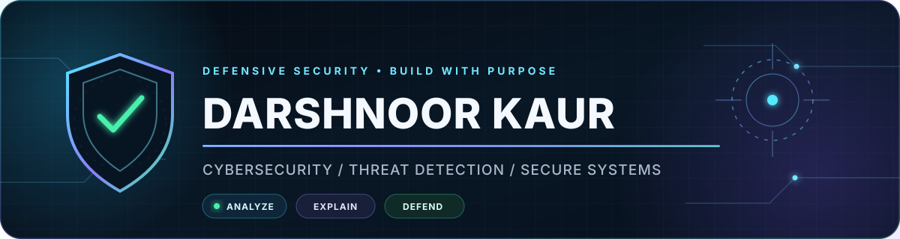

<div align="center">
  
</div>

<p align="center">
  <a href="https://darshnoor30.github.io/"></a>
  <a href="https://github.com/darshnoor30/SentinelScan"></a>
  <a href="https://github.com/darshnoor30/SentinelNet"></a>
</p>

## Security engineering, from signal to decision

I'm **Darshnoor Kaur**, a Computer Science Engineering student building defensive-security systems that are practical, explainable, and designed for analysts—not just demos.

My work sits at the intersection of **SOC operations, network security, phishing detection, machine learning, threat intelligence, and secure backend engineering**. I enjoy turning raw security signals into clear risk decisions and interfaces people can actually use.

```text
observe → enrich → detect → explain → prioritize → defend
```

> Open to cybersecurity, SOC, network-security, and security-engineering internship opportunities.

## Featured security work

<table>
  <tr>
    <td width="50%" valign="top">
      <h3>🛰️ SentinelScan</h3>
      <p><strong>AI-powered phishing URL detection platform</strong></p>
      <p>End-to-end React + FastAPI security platform combining 31 engineered URL/domain features, Random Forest classification, SSL/DNS/WHOIS analysis, explainable risk scoring, scan analytics, 18 deterministic tests, CI, and Docker support.</p>
      <p><code>React</code> <code>FastAPI</code> <code>Machine Learning</code> <code>Pytest</code> <code>Docker</code></p>
      <a href="https://github.com/darshnoor30/SentinelScan"><strong>Explore the flagship project →</strong></a>
    </td>
    <td width="50%" valign="top">
      <h3>🛡️ SentinelNet</h3>
      <p><strong>Explainable network detection and SOC console</strong></p>
      <p>Scapy-based packet-metadata pipeline with typed service rules, rolling-window port-scan detection, normalized alerts, analyst filters, severity analytics, a priority queue, safe demo data, 17 tests, and two-version CI.</p>
      <p><code>Python</code> <code>Scapy</code> <code>Streamlit</code> <code>Plotly</code> <code>Pytest</code></p>
      <a href="https://github.com/darshnoor30/SentinelNet"><strong>Open the SOC project →</strong></a>
    </td>
  </tr>
  <tr>
    <td width="50%" valign="top">
      <h3>🌐 Cybersecurity Portfolio</h3>
      <p><strong>Interactive project and experience showcase</strong></p>
      <p>Responsive GitHub Pages portfolio presenting verified security case studies, technical skills, credentials, and a downloadable résumé with accessible navigation, reduced-motion support, and build CI.</p>
      <p><code>HTML</code> <code>CSS</code> <code>JavaScript</code> <code>Vite</code> <code>GitHub Actions</code></p>
      <a href="https://darshnoor30.github.io/"><strong>Visit the live portfolio →</strong></a>
    </td>
    <td width="50%" valign="top">
      <h3>🎣 Phishing Email Detector</h3>
      <p><strong>Transparent rule-based phishing analysis</strong></p>
      <p>An offline, explainable engine that weights social-engineering language and URL heuristics, reports evidence and next steps, and offers CLI plus Tkinter interfaces with a 10-test, 90% coverage gate.</p>
      <p><code>Python</code> <code>Tkinter</code> <code>Pytest</code> <code>GitHub Actions</code></p>
      <a href="https://github.com/darshnoor30/phishing-email-detector"><strong>View the foundation project →</strong></a>
    </td>
  </tr>
</table>

## Technical arsenal

<p>
  
  
  
  
  
  
  
  
  
  
</p>

<p>
  
  
  
  
  
  
  
  
</p>

## How I build security projects

| Principle | What it means in my work |
|---|---|
| **Explain the verdict** | Surface evidence, confidence, severity, and human-readable reasons—not only a label. |
| **Design for the analyst** | Prioritize triage queues, filters, timelines, history, and usable security context. |
| **Test the detection path** | Separate collection from detection and validate benign, suspicious, and failure cases. |
| **Handle data responsibly** | Minimize retained telemetry, keep secrets out of Git, and document defensive-use boundaries. |
| **Ship the whole system** | Connect models and rules to APIs, storage, interfaces, documentation, and CI. |

## Current trajectory

- Deepening practical **SOC analysis, network defense, and incident triage**
- Building **explainable AI for phishing and threat detection**
- Strengthening **cloud, API, database, testing, and deployment** foundations
- Turning academic learning into recruiter-verifiable engineering projects

## Learning and credentials

`Cisco Introduction to Cybersecurity` · `Cybersecurity Analyst Job Simulations` · `AWS Academy Labs` · `Identity & Access Management` · `Security Analytics`

<div align="center">
  <br />
  <strong>Let's build security systems that make the signal—and the reasoning—clear.</strong>
  <br /><br />
  <a href="https://darshnoor30.github.io/">Portfolio</a>
  &nbsp;•&nbsp;
  <a href="https://github.com/darshnoor30?tab=repositories">Repositories</a>
  &nbsp;•&nbsp;
  <a href="https://github.com/darshnoor30/darshnoor30.github.io/blob/main/Darshnoor_Kaur_Resume.pdf">Résumé</a>
</div>
